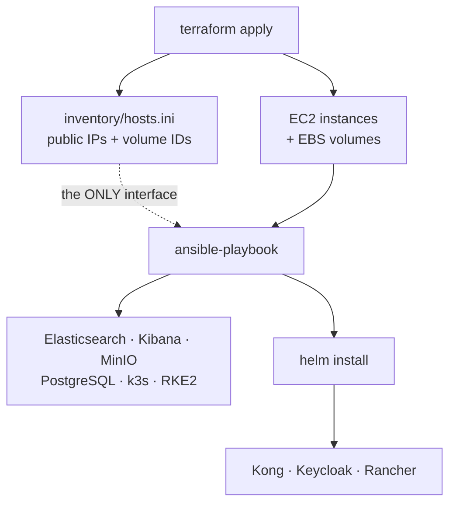
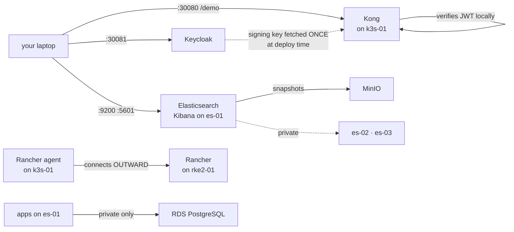
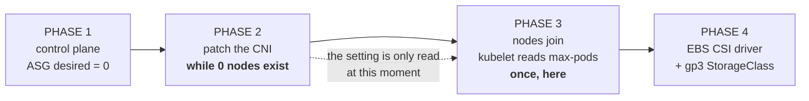

# Architecture: what builds what, and what calls what

A lab of five machines running Elasticsearch, two Kubernetes clusters, an API
gateway and an identity provider — plus an EKS cluster carrying the GitOps and
progressive-delivery tracks. **Every arrow here was executed and verified, not
sketched from intent.**

---

## The mental model: two planes, and everything belongs to one

Almost every confusing question about this system resolves once you know which
plane a thing lives in. **Terraform and Ansible build; Kong and Rancher serve.**
They never run at the same time, and they fail in completely different ways.

| Build plane — runs once, then exits | Runtime plane — stays up, answers requests |
|---|---|
| **Terraform** makes machines and disks exist | **Elasticsearch**, **Kong**, **Keycloak**, **Rancher**, **RDS** |
| **Ansible** installs and configures software on them | These are what a user or another service actually talks to |
| **Helm** deploys apps into Kubernetes | They know nothing about Terraform or Ansible |
| When these finish, nothing of them is left running | |

---

## The build chain

The important part is in the middle: **Terraform does not tell Ansible
anything directly.** It writes a file, and Ansible reads that file. That file is
the entire interface between the two tools.

Delete `inventory/hosts.ini` and Ansible has no idea the lab exists — regenerate
it with `terraform apply`.

---

## The runtime call graph

Now forget every tool above; none of them is running. This is what a request
actually touches.

Two arrows are worth pausing on:

- **Kong never calls Keycloak per request.** It fetched the signing key once at
  deploy time and verifies signatures locally — which is why a revoked token
  stays valid until it expires.
- **The Rancher agent connects outward.** Rancher never opens a connection to a
  cluster it manages, which is how you manage a cluster behind NAT with no
  inbound ports.

---

## The EKS build: four phases, because two steps are unrepeatable

| Do it in order | Do phase 2 late |
|---|---|
| **110 pods/node · 58 running · 0 pending** | 17 pods/node · 51 total · the addon layer does not fit |

**This is the one ordering rule that cannot be recovered from by re-running.**
Every other failure here is fixed by applying the correct config again. This one
is not: the pod ceiling is read by kubelet at boot and never re-read, so a node
that joined before the CNI was patched must be **terminated and replaced**.

Phase 4 exists for a similar reason: EKS 1.33 ships a `gp2` StorageClass marked
default whose provisioner (`kubernetes.io/aws-ebs`) was **removed in Kubernetes
1.27**. It can never bind a PVC, and the symptom — *"pod has unbound immediate
PersistentVolumeClaims"* — reads as a scheduling problem.

---

## Order that cannot be swapped

These are not preferences. Each caused a real failure when it was wrong, and
most failed **silently** — the build reported success and the breakage surfaced
somewhere unrelated.

| This must happen first | Before this | Or else |
|---|---|---|
| `storage` role mounts the disk | `elasticsearch` role installs | Mounting over a directory that already holds data **hides** it. The cluster comes back empty. |
| Package installed, so the `elasticsearch` user exists | `chown` of the data directory | You cannot chown to a user that does not exist yet; Elasticsearch then cannot write. |
| An ingress controller exists | Rancher is installed | Rancher's chart only makes an Ingress. With no controller, nothing serves it and no cluster can be imported. |
| `cert-manager` | Rancher | Rancher will not start without an issuer for its certificate. |
| The credential `Secret` | The `KongConsumer` that names it | Kong's admission webhook rejects a consumer whose credential is missing — and it **succeeds on a re-run**, so it only breaks on a clean cluster. |
| Keycloak running and its realm imported | Kong's JWT credential is written | The signing key is generated with the realm. Hardcode it and the lab works exactly once. |
| `cloud-init` has finished | Any `apt` command | Ubuntu runs its own apt jobs at boot. Race them and your install blocks on the dpkg lock, looking like it is just slow. |
| The CNI carries `ENABLE_PREFIX_DELEGATION` | The first EKS node boots | kubelet computes its pod ceiling **once**, at bootstrap. Patch afterwards and existing nodes keep advertising 17 pods, at 35% CPU. |
| A working `StorageClass` | Anything with a PVC | The stock `gp2` uses a provisioner removed in 1.27. PVCs sit `Pending` forever. |
| An AppProject permits a repo and namespace | An Application that uses them | Rejected at the **spec** level — no failed sync, no operation to inspect, `Unknown/Unknown` in `kubectl get app`, reason only in `status.conditions`. |
| ingress-nginx exports metrics | Flagger runs a canary | Metrics are off by default, so the series never exists and Flagger halts with *"not receiving traffic"* while the app is visibly serving. |
| `secret/apisix-admin` exists | The APISIX controller starts | The GatewayProxy references it by name. Without it the controller cannot authenticate, pushes nothing, and every route 404s while every pod reads Running. |

---

## Which machine runs what

| Host | Runs | Reachable on |
|---|---|---|
| **es-01** | Elasticsearch, Kibana, MinIO, PostgreSQL | `:9200` `:5601` `:9001` |
| **es-02 · es-03** | Elasticsearch | private only |
| **k3s-01** | k3s, Kong, Keycloak, Rancher agent | `:30080` `:30081` |
| **rke2-01** | RKE2, cert-manager, Rancher | `:443` |
| **RDS** | Managed PostgreSQL | no public address — configured *through* es-01 |
| **EKS** (separate) | Argo CD, Flux, Rollouts, Flagger, APISIX, Prometheus | NodePorts, see `make urls` |

---

## Four things that surprise everyone

**A host cannot reach its own public IP.** A check running *on* es-01 that points
at es-01's public address goes out to the internet gateway and back into a
firewall that only admits your laptop. It times out while the service is
perfectly healthy. Use `127.0.0.1` or the private address for anything a host
does to itself. This bit three separate times.

**Managed services have no host to log into.** RDS has no SSH and no public
address, so there is nothing for Ansible to connect to. It is configured
*through* es-01, which is allowed to reach it. That is the general shape for
every managed service: you configure a host permitted to talk to it, not the
thing itself.

**On EKS, "too small" can mean IP addresses.** A node with 65% of its CPU free
refused to schedule anything, reporting *Too many pods*. Every pod gets a real
address from the VPC, handed out by network interfaces whose count is fixed by
instance type. So there are **three** ways to be full — memory, CPU, and
*addresses* — and the third is invisible on GKE and k3s, which use overlay
networks.

**Two kinds of "too small" look identical.** One node froze because it ran out of
memory; another failed because a burstable instance had spent its CPU credits and
was getting a fifth of the CPU it appeared to have. Both look like *"it's slow
and things are crashing"*. `free -m` tells you the first; `top` and the `st`
(steal) column tell you the second — and steal cannot be fixed from inside the
machine at all.

---

Built with Terraform and Ansible, verified end to end against live AWS accounts
and rebuilt from zero several times to confirm it reproduces. See
[`VERIFIED.md`](../VERIFIED.md) for what has been run end to end and what has not.
