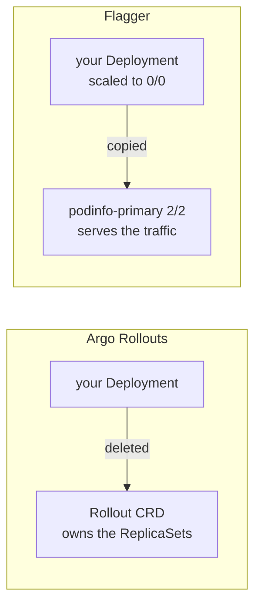

# GitOps delivery styles, measured

Argo CD · Flux · Argo Rollouts · Flagger · APISIX — every number below came from
a scripted scenario against a live EKS v1.33 cluster. Nothing is quoted from
documentation, and where a first attempt was wrong the wrong result is kept
alongside the corrected one, because the gap between them is the part worth
reading.

Re-run any of it with `./scripts/scenario run NN`.

---

## Reconciliation is not delivery

GitOps guarantees the cluster matches git. It says nothing about whether what is
in git **works**. Push a broken image and both controllers deploy it faithfully,
keep deploying it, and — if self-healing is on — undo your attempt to fix it by
hand.

```
a broken image tag, pushed to main

argocd   serving=3 broken=1 for 105s    health: Progressing -> Degraded
flux     serving=3 broken=1 for 105s    ReconciliationSucceeded

git revert + reconcile -> both recovered in 26s
```

Neither rolled back. What kept the service alive was **Kubernetes, not the
GitOps controller** — a Deployment's rolling update refuses to scale down healthy
old pods until new ones are Ready. That is the entire free safety net.

---

## One watches the cluster, one watches the source

Almost every measured difference falls out of this single design choice.

| | Argo CD | Flux |
|---|---|---|
| watches | the **cluster**, continuously | the **source**, on an interval |
| notices drift | in seconds | only on the next tick |
| notices a commit | polls git ~every 3 min | within its interval |

| Scenario | Argo CD | Flux |
|---|---|---|
| Manual drift undone | **~10s** | still drifted at 80s |
| `git push` to live | 155s | **78s** |
| Namespace deleted underneath it | recovered **24s** | gone at 120s, reporting `ready=True` |
| Pod unschedulable | never broke | `pending=1` for 84s, `ReconciliationSucceeded` |
| Broken release | no rollback | no rollback |

Argo CD's status answers *"does the cluster match git, and is it healthy?"*
Flux's answers *"did my last apply succeed?"* For **84–120 seconds Flux reported
`True` while the workload was degraded or gone.**

That is not a bug — Flux reports exactly what it measured, at the last tick. But
it decides where your alerts go: with Flux, alert on the **workload**; with Argo
CD you can alert on the **Application**.

---

## The two add-ons invert each other

Progressive delivery needs a second controller, and the two available ones take
opposite approaches to your existing Deployment.



Seeing `podinfo 0/0` next to `podinfo-primary 2/2` is the moment Flagger's model
clicks: **your Deployment is now a template, not a running thing.**

| | Argo Rollouts | Flagger |
|---|---|---|
| Your Deployment | replaced by a `Rollout` | kept, scaled to zero, copied |
| Rollout driven by | explicit **steps** | **metric analysis** |
| Analysis | optional | the whole point |
| Blue/green without a mesh | yes | yes (`kubernetes` provider) |

**Flagger is safe by default and hard to start** — it will not advance without
metrics, so it will not advance until the metrics pipeline genuinely works.
**Argo Rollouts is easy to start and unsafe by default** — it ships a rollout
that advances on a timer, and the two things that make it *judge* are both
opt-in. Neither default is wrong; they fail in opposite directions.

---

## What each style actually costs

Choose by what infrastructure the style demands, not by which sounds most
sophisticated.

| Style | Needs | Gives you |
|---|---|---|
| Rolling update | nothing | old pods stay up until new ones are Ready |
| Blue/green | a second Service | instant switch, instant rollback, all-or-nothing |
| Canary **by replica count** | nothing | an *approximation* of a percentage |
| Canary **by weight** | a traffic provider (nginx, Istio, ALB, APISIX) | real percentages, and analysis that means something |
| A/B | a traffic provider **with header/cookie matching** | a stable cohort |

Blue/green is the sweet spot on a cluster with no mesh — it repoints Services
rather than weighting traffic, so it works anywhere.

---

## The trap: a canary that cannot judge is only containment

```
a broken image through a canary with steps but no analysis

t+120s   phase=Progressing  step=0  serving=3  broken=1
         message: "more replicas need to be updated"
```

It capped the blast radius at 25% and **stopped**. It did not roll back. Steps
*pause*; they do not *judge*.

And the first attempt at analysis was worse than useless: a template curling the
app's `/healthz` reported **`Successful` while a broken pod sat there**. Not a
bug — without traffic routing there is no separate canary Service, so the check
hit the *stable* Service, still backed by three healthy old pods, and honestly
returned 200.

### Adding the traffic layer — and what it did *not* fix

```
the SAME broken image, now WITH a traffic provider

t+100s   phase=Degraded  "RolloutAborted"  weight=0  broken RS scaled to 0
         analysisrun: Successful          <- still

$ kubectl get svc podinfo-canary -o jsonpath='{.spec.selector}'
{"app":"podinfo","rollouts-pod-template-hash":"86d9ccdc4d"}   <- the STABLE hash
$ kubectl get svc podinfo-stable -o jsonpath='{.spec.selector}'
{"app":"podinfo","rollouts-pod-template-hash":"86d9ccdc4d"}   <- identical
```

Argo Rollouts only re-points the canary Service once the canary ReplicaSet has
an **available pod**. A canary stuck in `ImagePullBackOff` never gets there, so
both Services keep the stable hash and the analysis correctly measures healthy
old pods. **There is genuinely no canary to judge.**

What aborted it was one missing line: `progressDeadlineAbort: true`. Without it,
`progressDeadlineSeconds` only *marks* the rollout Degraded and leaves the canary
in place — exactly the "capped but stuck" behaviour above.

| Failure | Caught by | Time | Why the other is blind |
|---|---|---|---|
| broken image, never becomes ready | `progressDeadlineAbort` | **100s** | no canary Service is ever pointed at it, so analysis has nothing to measure |
| healthy but too slow (SLO breach) | the `AnalysisTemplate` | **50s** | the rollout *is* progressing — toward something bad. No deadline is exceeded |

```
the second case: a pod that is Ready and passing every probe

t+20s   canary Service re-pointed to the NEW hash, weight=25
t+40s   analysis job: "canary within 1s: 0/30 = 0%"
t+50s   phase=Degraded  analysis=Failed  weight=0  traffic back on stable
```

**The two safety nets cover disjoint failures, and a rollout with only one has a
blind spot.** Note what the second case *is*: a release that returns 200 in four
seconds. Every probe green, every dashboard green, and the users are the
monitoring. A status-code check would have passed it.

---

## Flagger, complete — and the two things nobody mentions

```
GOOD release                          BAD release (500s injected)

t+30s   Progressing  weight 10        t+15s   weight 10  failedChecks 1
t+45s                weight 20        t+30s   weight 10  failedChecks 2
t+60s                weight 30        t+45s   weight 10  failedChecks 3
t+75s                weight 40        t+60s   weight 10  failedChecks 4
t+90s                weight 50        t+75s   weight 10  failedChecks 5
t+105s  Promoting                     t+90s   Failed - weight 0, rolled back
t+135s  Finalising
t+150s  Succeeded
```

**The weight never advances past 10 on the bad release.** Flagger's `stepWeight`
is not a schedule, it is a reward for passing — where Argo Rollouts' steps
advance on a timer unless something stops them. **90 seconds to a completed
rollback with no analysis template written anywhere**, because the metrics *are*
the loop.

Two things blocked this for a long time, and both produce the *same* misleading
error:

```
Halt advancement no values found for nginx metric request-success-rate
probably podinfo.demo-flagger is not receiving traffic
```

1. **ingress-nginx ships with `controller.metrics.enabled=false`.** The
   `nginx_ingress_controller_requests` series never exists. Reads like a Flagger
   fault; it is an ingress-nginx setting.
2. **The load generator pointed at the Service**, bypassing nginx entirely. Real
   traffic the metric cannot see is indistinguishable from no traffic.

A third emerged once those were fixed: `request-success-rate` is a *rate over the
last minute of namespace-wide counters*, so error traffic left running from a
previous experiment made the **next** good release fail at *"success rate 36.89%
< 99%"* while every manual curl returned 200. **Experiment hygiene is part of the
measurement.**

---

## A/B is not a canary, and not an Argo Rollouts feature on nginx

A canary is a **random percentage** — the same user can see v1 then v2 on the
next click. A/B is a **predicate on the request**: same cohort, same answer,
every time. That stability is not a nicety; a conversion metric measured over a
randomly re-sampled population is not attributable to anything.

The obvious implementation is `setHeaderRoute`. It is rejected at admission:

```
spec.strategy.steps[1].setHeaderRoute: Invalid value: {...}:
SetHeaderRoute requires TrafficRouting, supports Istio and ALB and Apisix
```

The Rollout goes straight to `Degraded` with **zero replicas**. Weighted
`trafficRouting.nginx` *is* supported — the canary above depends on it. Header
and mirror routing are the exclusions.

Built instead on ingress-nginx's own annotations — two Ingresses, **same host and
path**, one marked canary:

| 20 requests sent with… | variant A | variant B |
|---|---|---|
| no header | **20** | 0 |
| `X-Cohort: beta` | 0 | **20** |
| `X-Cohort: control` (present, not matching) | **20** | 0 |
| `Cookie: ab-cohort=always` | 0 | **20** |

All at `canary-weight: 0`. nginx evaluates header and cookie matches **before**
weight, and that precedence is the whole mechanism — get it backwards and you
have a canary with extra steps.

---

## The canary blind spot: it is a `GROUP BY`, not a gateway flaw

On APISIX, a 90/10 weighted split with v2 broken, over one five-minute window:

| view | success rate | would it alert? |
|---|---|---|
| `sum by (route, code)` | 652/663 = **98.3%** | no |
| `sum by (route, code, node)`, v2 only | 36/47 = **76.6%** | yes |

Same samples, same window, **one `GROUP BY` apart**.

The arithmetic is the point. v2 gets 10% of traffic and fails every request;
route-level success goes 100% → 90%. Now make it a realistic 2% first step:
100% → 98%. **Nothing fires. The canary is completely broken and the dashboard
is green.**

The fix is not a better threshold, and — the part that surprised me — not a
config change either. **APISIX already emits a `node` label** carrying the
upstream pod IP, so the branches were distinguishable in the data all along. The
blind spot is created by `sum by (route, code)`, which is the default shape of
every dashboard panel.

Measured alongside it: the configured 90/10 split produced **183/17** over 200
requests, and stickiness — 20 requests from one browsing user hit **both**
branches (18/2). Correct for a canary; disqualifying for an A/B test.

---

## The EKS limit that blocked all of it

None of the above fitted on the cluster at first, and the error pointed nowhere
near the cause:

```
0/2 nodes are available: 2 Too many pods
cpu 680m (35%)          <- plenty of CPU free
max_pods/node: 17
```

On EKS every pod takes a **real VPC IP from an ENI**, so pod density is capped by
instance type, not CPU or memory. A `t3.medium` allows 17 pods however idle it
is. **This is invisible on GKE and on k3s**, which use overlay networks.

`ENABLE_PREFIX_DELEGATION` is the well-known half. The half that is not:
**kubelet computes `max-pods` once, at bootstrap.** Flip only the daemonset and
existing nodes keep advertising 17 forever. You need the CNI setting, *and*
`--max-pods` pinned in the node bootstrap config, *and* the daemonset patched
before any node joins — three phases, not one `terraform apply`.

"Use a bigger instance" was not available: an organization SCP denies
`ec2:RunInstances` for every type except `t3.medium`. Result after the fix:
**110 allocatable pods per node, 58 running, 0 Pending.**

---

## Two rules these experiments encode, both paid for

**Break it through git, not `kubectl`.** The first broken-release scenario used
`kubectl set image`; Argo CD's selfHeal reverted it in 12s, so it measured
selfHeal rather than a bad release — and made Flux look worse purely because its
interval had not elapsed.

**Never suppress the output of the thing whose failure you are testing, and
assert before you conclude.** One scenario hid a rejected patch and reported
"Healthy" for 96 seconds. Another printed "aborted and rolled back" while its
`kubectl set image` had silently failed — `set` resolves types against kubectl's
compiled-in scheme and cannot touch a CRD at all.

---

## What is still not proven

Multi-cluster GitOps, image automation, and progressive delivery driven by real
production metrics rather than a synthetic load generator. Ephemeral
per-pull-request environments are configured on the Flux side and render an
empty set, because nothing carries the trigger label — correct behaviour that
looks identical to a broken provider.

See [`VERIFIED.md`](../VERIFIED.md) for the full ledger of what has been run
end to end and what has not.
